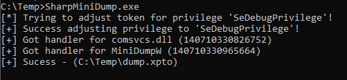

# SharpMiniDump

Tired of using "rundll32.exe" to run MiniDump for your LSASS dump?

This project is perfect for you!

A C# port using pinvoke and some magic to do your nasty job.



Usage
```
SharpMiniDump.exe "c:\temp"
```

## OpSec Considerations

- It uses PInvoke, feel free to update it with DInvoke for a more stealthy approach.
- File is created with "xpto" extension, but you can update it.
- This code tries to adjust your token to enable 'SeDebugPrivilege'